# 2024_IA651_Kranthi_Vishal
Final Project of Kranthi Chaithanya Thota and Vishal Singarapu for IA651

Under the guidance of professor Michael Gilbert (mgilbert@clarkson.edu) and GA Nisar Ahamad Killedar (killedn@clarkson.edu)

# Developing ML Models to build a predictive relationship between Lifestyle attributes and Cancer.

This repository contains code for predicting Cancer using machine learning models. The project utilizes various preprocessing techniques, SMOTE for handling class imbalance, dimensionality reduction, and several machine learning models for classification.

## Table of Contents
- [Introduction](#introduction)
- [Dataset](#dataset)
- [Preprocessing](#preprocessing)
- [Modeling](#modeling)
- [Evaluation](#evaluation)
- [Results](#results)
- [Usage](#usage)
- [Dependencies](#dependencies)

## Introduction

The aim of this project is to predict the presence of Cancer in individuals using various machine-learning models. The project leverages preprocessing techniques to prepare the data, PCA to reduce dimensionality and applies SMOTE to handle class imbalance. The models used include Logistic Regression, Random Forest, XGBoost, Decision Tree, SVC etc.

## Dataset

### Overview of the Dataset
The Behavioral Risk Factor Surveillance System (BRFSS) is one of the largest continuously conducted health surveys in the world. Established in 1984 by the Centers for Disease Control and Prevention (CDC), BRFSS collects data from U.S. residents about their health-related risk behaviors, chronic health conditions, and use of preventive services.

### Key Features of the BRFSS Dataset:
**Scope** : The dataset covers various health-related topics including physical activity, diet, tobacco use, alcohol consumption, health care access, and chronic diseases.

**Population**: The survey targets adults aged 18 and older living in households across the United States.

**Data Collection** : Data is collected through telephone interviews, both landline and cellular.

**Usage** : The BRFSS data is widely used by public health officials, researchers, and policymakers to track health conditions, identify emerging health issues, establish and monitor health objectives, and develop and evaluate public health policies and programs.

### Common Variables in the BRFSS Dataset:

**Demographic Information**: Age, gender, race, education level, and income.

**Health Behaviors** : Smoking status, alcohol consumption, physical activity, and dietary habits.

**Chronic Health Conditions** : Presence of conditions like heart disease, diabetes, asthma, and hypertension.

**Preventive Health Measures** : Flu shots, cancer screenings, and other health check-ups.

**Health Status** : Self-reported health status, mental health, and physical health indicators.

The BRFSS dataset provides invaluable insights into the health trends and risk factors prevalent in the U.S. population, enabling effective public health interventions and policy-making.

### Dataset Link

Behavioral Risk Factor Surveillance System (BRFSS)   [Link To Dataset](https://www.cdc.gov/brfss/annual_data/annual_2022.html)

## Data Dictionary

This section provides detailed descriptions of the variables in the BRFSS dataset used for the heart and lung disease prediction project, including their actual variable names and mapped names.

### Demographic Information

| Actual Variable Name | Mapped Name           | Description                                             | Type     |
|----------------------|-----------------------|---------------------------------------------------------|----------|
| `_AGE_G`           | `AGE_CATEGORY`        | Age group of the respondent                             | Categorical |
| `_SEX`                | `GENDER`              | Gender of the respondent                                 | Categorical |
| `_PRACE2`           | `RACE`                | Race/ethnicity of the respondent                        | Categorical |
| `_INCOMG1`            | `INCOME_GRP`          | Income group of the respondent                          | Categorical |
| `EDUCA`              | `EDUCATION_CATEGORY`  | Education level of the respondent                       | Categorical |

### Health Behaviors

| Actual Variable Name | Mapped Name           | Description                                             | Type     |
|----------------------|-----------------------|---------------------------------------------------------|----------|
| `SMOKDAY2`           | `SMOKE_FREQ`          | Frequency of smoking                                    | Categorical |
| `_TOTINDA`           | `EXERCISE`            | Whether the respondent participates in physical activity | Categorical |
| `AVEDRNK3`           | `ACG_ALC`             | Alcohol consumption frequency                           | Numerical |
| `_RFDRHV8` | `HEAVY_DRINKER` | Whether the respondent is a heavy drinker or not | Categorical |
| `_SMOKER3` | `HEAVY_SMOKER` | Whether the respondent is a heavy smoker or not | Categorical |

### Chronic Health Conditions

| Actual Variable Name | Mapped Name           | Description                                             | Type     |
|----------------------|-----------------------|---------------------------------------------------------|----------|
| `DIABETE4`           | `HAS_PREDIABETES`     | Presence of prediabetes                                 | Categorical |
| `ADDEPEV3`           | `HAS_DEPRESSION`      | Presence of depression                                  | Categorical |
| `_ASTHMS1`            | `ASTHMA_STATUS`       | Asthma status                                           | Categorical |
| `_BMI5CAT`           | `BMI_CATEGORY`        | Body Mass Index (BMI) category                          | Categorical |

### Preventive Health Measures

| Actual Variable Name | Mapped Name           | Description                                             | Type     |
|----------------------|-----------------------|---------------------------------------------------------|----------|
| `PNEUVAC4`            | `HAD_PNEU_VACC`       | Whether the respondent had a pneumonia vaccination      | Categorical |
| `_HLTHPLN` | `HAS_HLTHCOVRGE` | Whether the respondent has a health insurance | Categorical |

### Time Series Data
| Actual Variable Name | Mapped Name           | Description                                             | Type     |
|----------------------|-----------------------|---------------------------------------------------------|----------|
| `YEAR`            | `IYEAR`       | Year when the data was collected | Numerical |
| `MONTH`           | `IMONTH`      | Month when the data was collected | Numerical |
| `DAY`             | `IDAY`        | Day when the data was collected | Numerical |

### Health Status

| Actual Variable Name | Mapped Name           | Description                                             | Type     |
|----------------------|-----------------------|---------------------------------------------------------|----------|
| `DECIDE`           | `MEMORY_LOSS`         | Whether the respondent has difficulty in concentrating, remembering or making decisions | Categorical |
| `PHYSHLTH`           | `BADPHYSHLTH_PAST30DAYS` | Number of days with poor physical health in the past 30 days | Numerical |
| `MENTHLTH`           | `BADMENTHLTH_PAST30DAYS` | Number of days with poor mental health in the past 30 days   | Numerical |

### Geographic Information

| Actual Variable Name | Mapped Name           | Description                                             | Type     |
|----------------------|-----------------------|---------------------------------------------------------|----------|
| `_STATE`             | `STATE_CODE`          | Code of the state where the respondent resides          | Categorical |

### Target Variables

| Actual Variable Name  | Mapped Name           | Description                                             | Type     |
|-----------------------|-----------------------|---------------------------------------------------------|----------|
| `CHCSCNC1` and `CHCOCNC1`    | `HAS_CANCER` | Indicator of Cancer Presence (Skin or any other type of Cancer) | Categorical |

## Exploratory Data Analysis

### Correlation Matrix of all the variables explaining the relation between each other
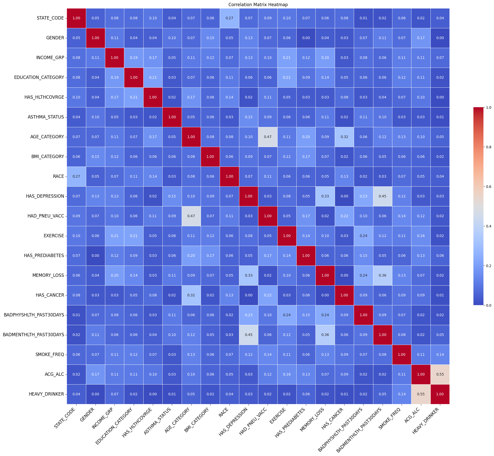

### Cancer population across all states in US
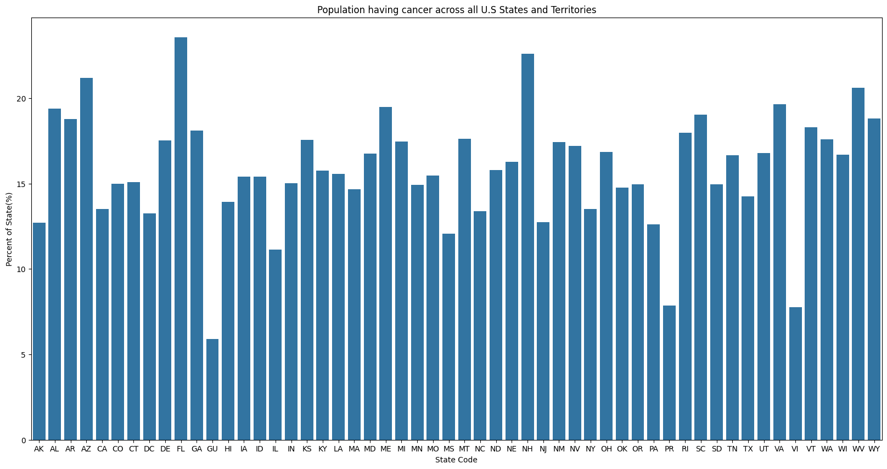

### Percentage of Male and Female population having Cancer in each Age Category
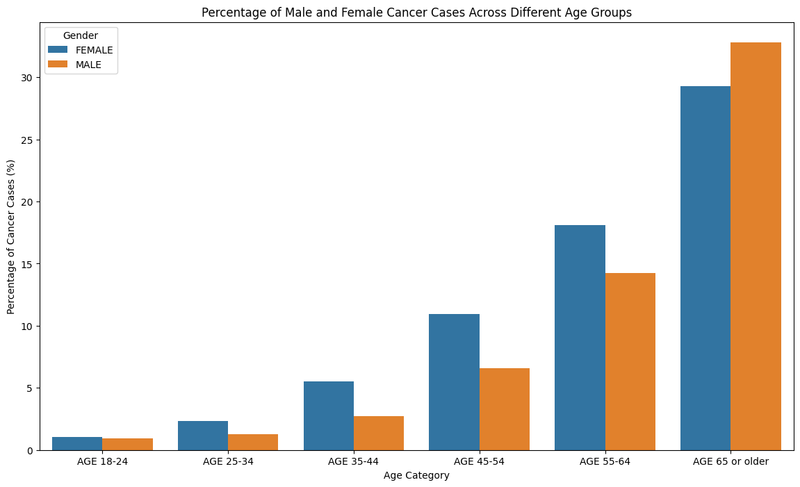

### Percentage of Male and Female population having Cancer in each Income Group
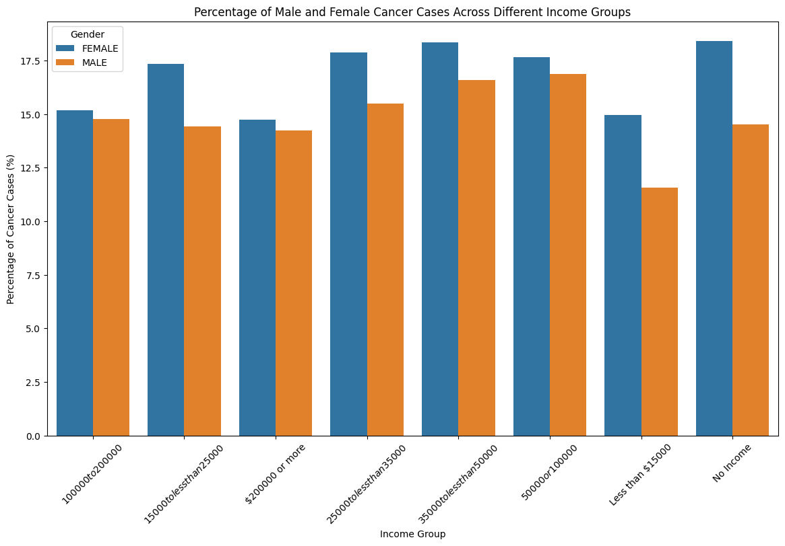

### Percentage of Male and Female population having Cancer in each BMI Category
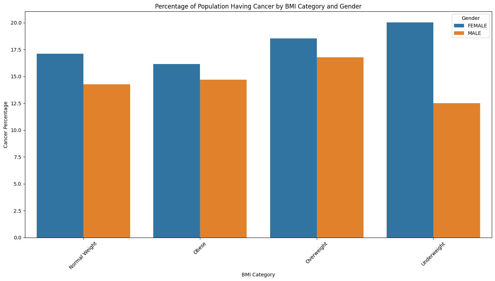

### Count of Number of Alcohol Drinks per Week for Male and Female having Cancer
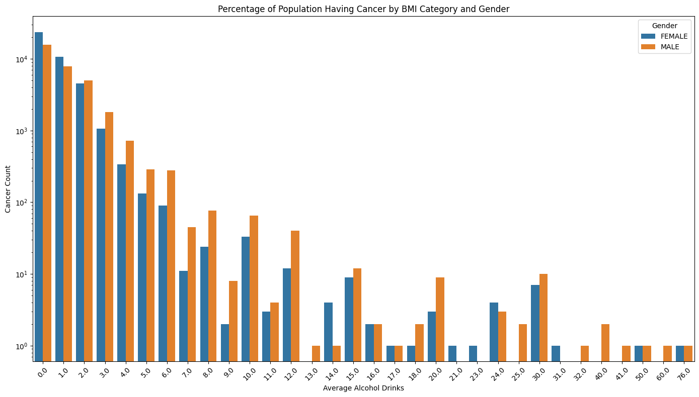

## Preprocessing

### Steps:
1. **Loading the Dataset**: The dataset is loaded using pandas.
2. **Defining Features and Targets**: 
   - Features: Various health-related and lifestyle-related attributes.
   - Targets: `HAS_CANCER` .
3. **Categorical, Ordinal and Numerical Columns**:
   - Categorical columns are one-hot encoded.
   - Ordinal columns are encoded using a dictionary with mappings for each value to maintain order.
   - Numerical columns are scaled using `StandardScaler`.
4. **Column Transformer**: Combines the one-hot encoding and scaling into a single transformer.

## Modeling

### Steps:
1. **Splitting the Data**: The dataset is split into training and testing sets using the train_test_split function from scikit-learn with 20% of the data reserved for testing. The 80/20 split was chosen based on the size and distribution of the data. It helps the model generalize well to unseen data. The split was stratified using the `HAS_CANCER` target variable to maintain the balance of target variable over the training and testing sets.

2. **Handling Class Imbalance**: SMOTE (Synthetic Minority Over-sampling Technique) is applied on the training_data to handle class imbalance of the target variable i:e `HAS_CANCER`. This was performed to prevent the model from being biased towards the majority class.

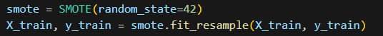

3. **Dimensionality Reduction**: PCA (Principal Component Analysis) is used to reduce the dimensionality of the data. The target variance was 90% which was achieved using only 26 components which is a significant reduction in the total number of features i:e 63.

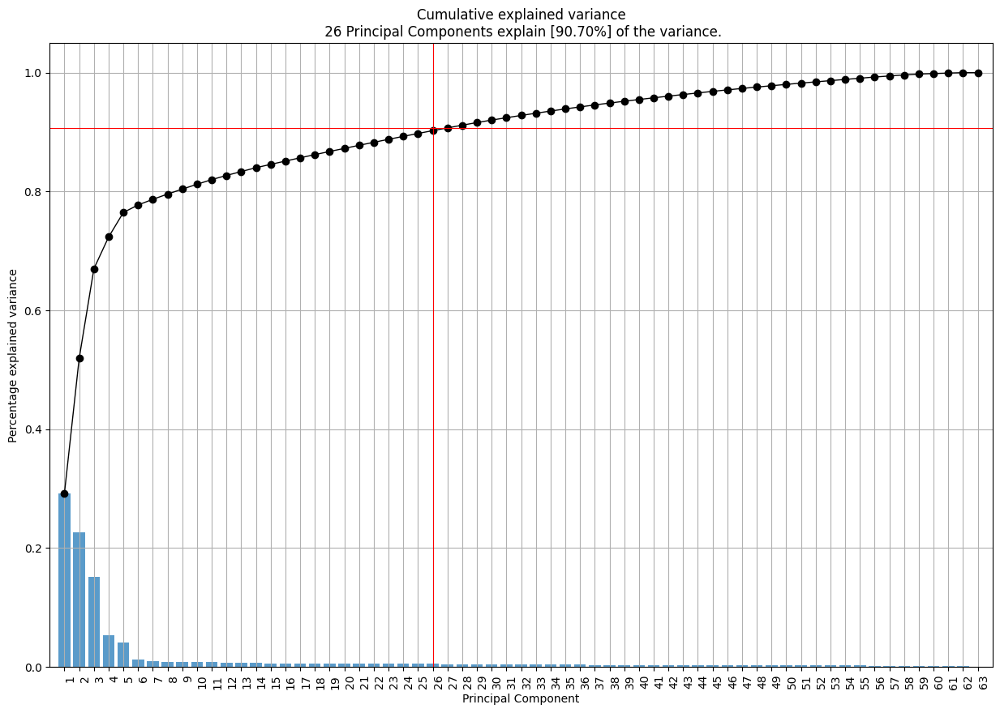

4. **Model Selection**: Various machine learning models are selected for prediction. These were selected because of their well-known performance against categorical variables and classification of data. Which is exactly what this project aims to achieve. 
   - Logistic Regression
   - XGBoost
   - Catboost
   - Decision Tree
   - Random Forest

5. **Hyper Parameter Tuning**: The hyper parameters of the best model were tuned using GridSearchCV with a total of 12 candidates.

## Evaluation

The models were evaluated using Precision, Recall, F1 score, Accuracy and confusion matrix.

### Metrics:
1. **Precision**: Measures the accuracy of the positive predictions.
2. **Recall**: Measures the ability to find all positive instances.
3. **F1 Score**: The harmonic mean of precision and recall.
4. **Confusion Matrix**: A table to describe the performance of the classification model.

## Results

Below are the results of different models. 
All of them are performed after executing the preprocessing steps.

The shape of the training dataset is (445132,26).

The shape of the testing dataset is (89027,26).

### Table:

| Model               | Precision | Recall | F1 Score | Accuracy |
|---------------------|-----------|--------|----------|----------|
| Logistic Regression | 0.62      | 0.71   | 0.60     | 0.67     |
| XGBoost             | 0.61      | 0.70   | 0.60     | 0.68     |
| CatBoost            | 0.61      | 0.69   | 0.60     | 0.69     |
| Decision Tree       | 0.57      | 0.60   | 0.57     | 0.71     |
| Random Forest       | 0.60      | 0.63   | 0.60     | 0.75     |

The main focus while building this predictive model was to identify as many cancer possibilities as possible even at the risk of mistaking someone for having cancer. So, to fulfill this objective we focused mainly on the `recall` .
Also, as our dataset was highly unbalanced which means accuracy was not a good metric to determine the performance of the model.

Based on above results and the balance of the target variable confusion matrix , we determined that `Logistic Regression` is the best model for this dataset.

### Logistic Regression Confusion Matrix
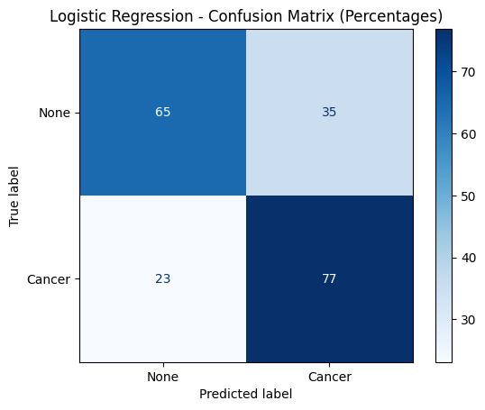

### Hyper-Parameter Tuning
We performed hyper parameter tuning to try and improve our logistic regression model using the below mentioned parameters.

'C': [0.01, 0.1, 1, 10, 100],

'penalty': ['l1', 'l2'],

'solver': ['liblinear', 'saga']

But the results we got after performing a gridsearchCV using a 5 Fold Cross-Validation Strategy were not satisfactory.

**Note** : Although SVC is a good model to predict categorical data, due to the size of the data in current scenario it becomes computationally expensive and takes a very long time to run. Hence it was not used to train the model.

### Prediction Examples
**LimeTabular Explainer** is a library that helps in visualizing the impact of each feature on the prediction.

Below are two examples of prediction in test set and the visualization it produces that helps in determining which feature impacted the prediction.

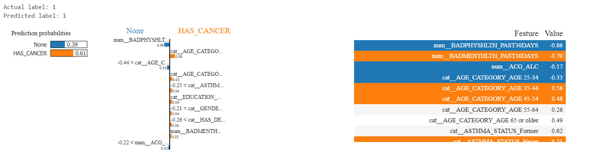
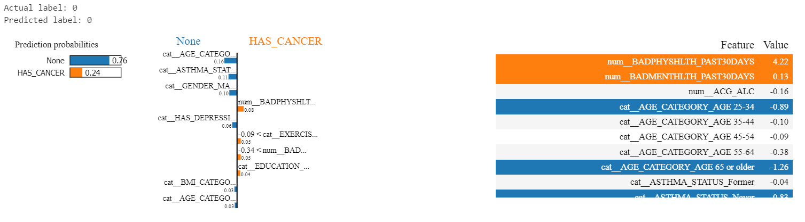

We have used an entirely new synthesized dataframe based on the existing data as Shown below.

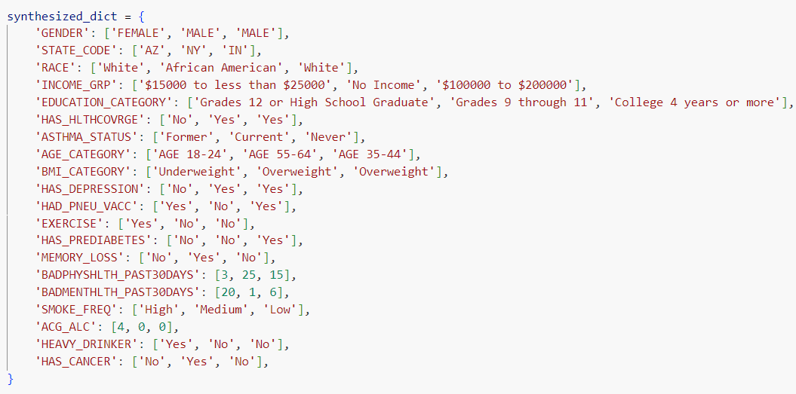

Below is the result of the predictions using the synthesized dataframe.

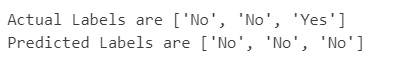

The predictions indicate that out of 3 new data points , 2 of them were predicted correctly of not having cancer.

## Usage

### Steps to Run:
1. Clone the repository.
2. Install the required dependencies.
3. Load the dataset.
4. Run the preprocessing steps.
5. Train the models.
6. Evaluate the models.

## Dependencies

List of dependencies required to run the project:

- pandas
- numpy
- scikit-learn
- xgboost
- catboost
- matplotlib
- seaborn
- imblearn
- lime_tabular_explainer
